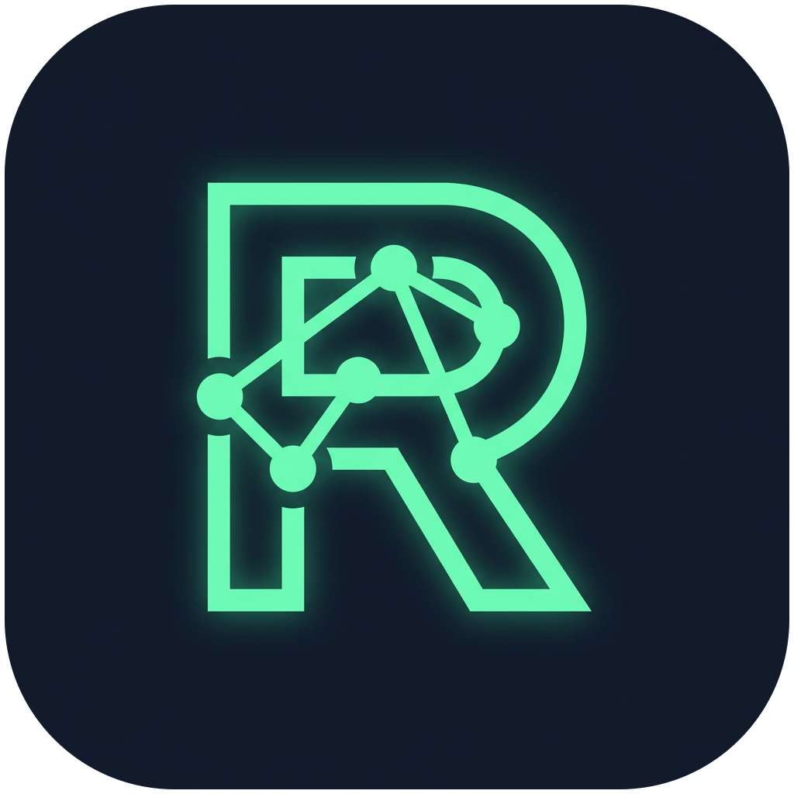
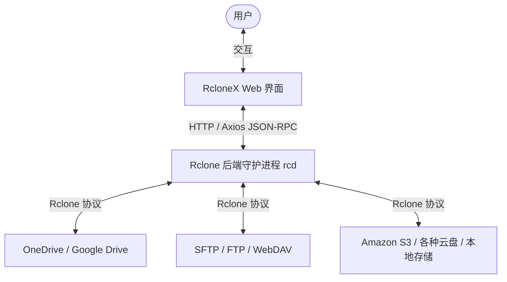

# RcloneX

<p align="center">
  
</p>

<h3 align="center">RcloneX</h3>

<p align="center">
  基于 React 19 + TypeScript + Rsbuild v2 构建的现代化 Rclone Web UI 前端管理面板。
</p>

<p align="center">
  
  
  
  
  
  
</p>

---

## 📖 项目简介

**RcloneX** 是一个功能强大且美观的 Rclone 远程控制（Remote Control, RC）API 前端客户端。它允许用户通过直观的 Web 界面直接管理、配置、浏览和操作连接到 Rclone 的各种远程存储服务。

### 架构示意图



---

## ✨ 核心特性

- 🔒 **简易认证登录**：支持配置 Rclone RC 服务的 URL 地址、用户名和密码，快速建立连接。
- 📊 **核心仪表盘**：实时监控当前的传输速率、带宽限制、已运行任务、CPU/内存占用等状态。
- ⚙️ **配置管理器 (CRUD)**：可视化创建、修改、删除及查看 Rclone Remotes。
- 📂 **多功能文件管理器**：
  - 浏览各个 Remote 的目录树。
  - 文件/文件夹的上传、下载、新建、删除。
  - 支持跨远程存储的文件复制与移动。
- ⏳ **任务与传输队列**：实时监控后台正在进行的同步、复制、移动等长耗时任务。
- 🔌 **挂载点管理**：可视化管理和控制 Rclone 的本地挂载（Mounts）。
- 📝 **系统日志监控**：实时查看 Rclone 运行日志，便于调试和排查问题。
- 🌍 **完整国际化**：完美支持中英文（`zh-CN` / `en-US`）双语切换。

---

## 🛠️ 技术栈

| 模块          | 技术选择                   | 描述                                             |
| :------------ | :------------------------- | :----------------------------------------------- |
| **核心框架**  | React 19                   | 全新架构，极致性能                               |
| **运行环境**  | Node.js v24.x              | 必须使用 Node 24 (项目已配置 .node-version 锁定) |
| **编程语言**  | TypeScript 7.0.2           | strict 模式保证类型安全                          |
| **构建工具**  | Rsbuild v2                 | 基于 Rspack，极速冷启动和热更新                  |
| **样式系统**  | Tailwind CSS v4            | 使用 CSS Variables 驱动主题                      |
| **UI 组件库** | shadcn/ui                  | new-york 风格组件，高度自定义                    |
| **网络请求**  | Axios                      | 封装为 `NetworkClient` 单例进行认证和响应拦截    |
| **表单验证**  | react-hook-form + Zod      | 类型安全的动态配置表单生成                       |
| **状态/主题** | next-themes + lucide-react | 极简暗黑/明亮主题切换，现代化图标库              |
| **国际化**    | i18next                    | 浏览器语言自动检测与中英文本地化                 |

---

## 📂 项目结构

```
src/
├── assets/              # 静态资源（如 appIcon.png）
├── components/          # 共享组件
│   ├── ui/              # shadcn/ui 基础组件
│   ├── Header.tsx       # 全局头部组件
│   └── ErrorFallback.tsx # 错误边界 fallback
├── hooks/               # 自定义 React Hooks
├── lib/utils/           # 样式合并与基础工具函数
├── locales/             # 国际化语言包 (en-US / zh-CN)
├── pages/               # 页面视图组件 (按路由组织)
│   ├── App.tsx          # 路由配置入口
│   ├── home/            # 框架主布局 (Sidebar + Header + Outlet)
│   ├── login/           # 登录鉴权页面
│   ├── dashboard/       # 仪表盘状态监控
│   ├── config/          # 配置中心
│   ├── explorer/        # 文件浏览器
│   ├── tasks/           # 任务列表
│   ├── mounts/          # 挂载管理
│   └── logs/            # 运行日志
├── shared/utils/        # 共享工具单例（网络、本地存储等）
├── styles/globals.css   # 全局样式与 Tailwind 配置
└── index.tsx            # 应用入口文件
```

---

## 🚀 快速上手

### 1. 克隆并安装依赖

首先确保你的系统安装了 **Node.js (v24.x)** 和 **nub**。

```bash
# 克隆仓库并进入项目目录
git clone https://github.com/hurole/RcloneX.git
cd RcloneX

# 安装依赖
nub install
```

### 2. 启动 Rclone Remote Control (RC) 守护进程

RcloneX 是一个纯前端项目，需要连接到一个运行中的 Rclone RC 服务。你可以通过以下命令在本地启动测试服务（需提前安装 Rclone）：

```bash
nub run start:rclone
```

> **该命令的实际执行内容：**
> `rclone rcd --rc-addr :5572 --rc-user dev --rc-pass 1234 --rc-allow-origin http://localhost:3000`

### 3. 启动开发服务器

在另一个终端中，运行以下命令启动 RcloneX 前端：

```bash
nub run dev
```

浏览器会自动打开并跳转至 `http://localhost:3000`。在登录页面输入对应的连接参数即可进入系统：

- **RC Address**: `http://localhost:5572`
- **Username**: `dev`
- **Password**: `1234`

---

## 💻 开发与维护

### 常用命令列表

| 命令              | 描述                                       |
| :---------------- | :----------------------------------------- |
| `nub run dev`     | 启动开发服务器（含热更新）                 |
| `nub run build`   | 编译打包生产环境产物                       |
| `nub run preview` | 在本地预览生产环境构建产物                 |
| `nub run check`   | 运行 TypeScript 语法与类型安全检查         |
| `nub run fmt`     | 运行 oxfmt 自动格式化项目代码              |
| `nub run lint`    | 运行 oxlint 进行代码 Lint 静态检查         |
| `nub run test`    | 运行 Vitest 进行单元与集成测试（单次运行） |
| `nub run sentry`  | 上传 source map 至 Sentry 进行错误监控     |

### 编码规范与工作流

为了维护代码库的高质量，请遵循以下规范：

1. **修改代码后必须运行格式化与语法检查**：
   ```bash
   nub run lint
   nub run fmt
   nub run check
   ```
2. **组件定义**：
   - 统一使用函数式组件 + `FC` 类型或 `export default function`。
   - 所有 UI 组件应当直接引用自 `@/components/ui/`（基于 shadcn/ui）。
   - 文件扩展名一律使用 `.tsx`。
3. **国际化 (i18n)**：
   - 所有页面中直接展示给用户的文本，必须使用 `useTranslation` hook 的 `t()` 函数。
   - 对应文案须在 [locales](file:///Users/hurole/code/RcloneX/src/locales/) 目录下的 `en-US` 和 `zh-CN` 两个 JSON 文件中同时添加。
4. **类型定义**：
   - 禁止在项目中使用 `any` 类型，优先使用 `unknown` 并做类型守卫。
   - 接口定义尽量放置在靠近其消费的 `services` 或组件中。

---

## 📄 开源许可证

本项目基于 **MIT License** 开源，详情请参阅 `LICENSE` 文件。
