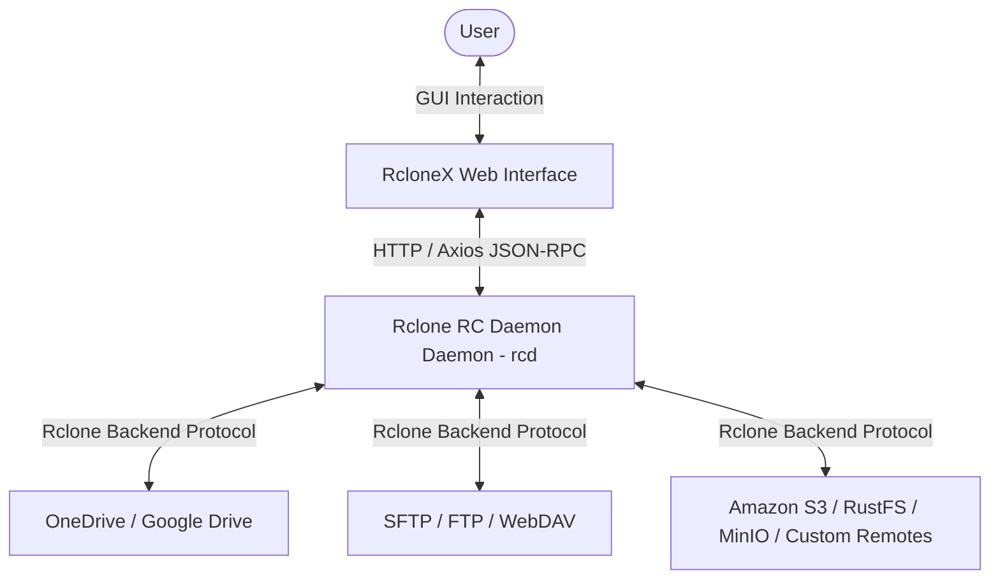

<p align="center">
  <a href="https://github.com/hurole/RcloneX">
    
  </a>
</p>

<h1 align="center">RcloneX</h1>

<p align="center">
  <strong>✨ A modern, high-performance Rclone Web UI Management Panel built with React 19, TypeScript 7.0.2, Rsbuild v2, and Tailwind CSS v4 ✨</strong>
</p>

<p align="center">
  <strong>English</strong> •
  <a href="README_ZH.md">简体中文</a>
</p>

<p align="center">
  <a href="https://react.dev">
    
  </a>
  <a href="https://www.typescriptlang.org">
    
  </a>
  <a href="https://rsbuild.dev">
    
  </a>
  <a href="https://tailwindcss.com">
    
  </a>
  <a href="https://ui.shadcn.com">
    
  </a>
</p>

<p align="center">
  <a href="#-key-features">Key Features</a> •
  <a href="#-tech-stack-highlights">Tech Stack</a> •
  <a href="#-getting-started">Getting Started</a> •
  <a href="#-project-structure">Project Structure</a> •
  <a href="#-development--maintenance">Development</a> •
  <a href="#-contributing">Contributing</a>
</p>

---

> 🚧 **Note:** This project is currently **under active development**. Features and UI are evolving rapidly. Feedback and contributions are warmly welcomed!

## 📖 Introduction

**RcloneX** is a powerful and aesthetically crafted web client for the Rclone Remote Control (RC) API. It empowers users to manage, configure, browse, and operate various remote storage services connected to Rclone through an intuitive, fluid, and responsive web user interface.

### 📡 Architecture Overview



---

## ✨ Key Features

- 🔒 **Secure Authentication**: Connect seamlessly to your Rclone RC daemon using custom server URLs and credentials.
- 📊 **Real-time Dashboard**: Monitor network bandwidth speed, active transfers, system status, and storage quota summaries at a glance.
- ☁️ **Smart Remote Hub**: Easily manage remote storage configurations (CRUD). Direct one-click access to Explorer, local virtual disk mounting, and connectivity testing probes.
- 📂 **Feature-rich File Explorer**:
  - Browse dynamic directory trees across any remote.
  - Upload, download, create, and delete files with high responsiveness.
  - Seamlessly copy or move files across different cloud remotes.
- ⏳ **Task & Transfer Management**: Track ongoing background sync/copy/move operations with progress indicators.
- ⏱️ **Scheduled Tasks**: Configure periodic background sync and backup automation rules.
- 🔗 **Mount Points Manager**: Visually manage and control local Rclone mounts to turn cloud drives into local virtual disks.
- 📝 **Live System Logs**: Stream real-time Rclone logs for effortless debugging and monitoring.
- 🌍 **Full Internationalization (i18n)**: Out-of-the-box support for switching between English (`en-US`) and Chinese (`zh-CN`).

---

## ⚡ Tech Stack Highlights

RcloneX leverages the latest cutting-edge web ecosystem for maximum performance and developer experience:

- 🚀 **Blazing Fast Builds (Rsbuild v2)**: Powered by Rspack, providing sub-millisecond HMR and instant cold starts.
- 💎 **Modern Standards (React 19 + TypeScript 7)**: Strict type safety without unnecessary boilerplate wrappers.
- 🏎️ **Next-Gen Linting & Formatting (Oxc Toolchain)**:
  - **`oxlint`**: Lightning-fast static code analysis.
  - **`oxfmt`**: Instant code formatting paired with `@fka/oxfmt-config`.
- 🎨 **Premium UI Aesthetics (Tailwind CSS v4 + shadcn/ui)**: Clean design tokens using Tailwind CSS v4 variables with seamless dark/light mode switching.

---

## 🚀 Getting Started

### 1. Prerequisites

Ensure you have **Node.js (v24.x)** and the **nub** modern package manager installed.

### 2. Clone & Install

```bash
# Clone the repository
git clone https://github.com/hurole/RcloneX.git
cd RcloneX

# Install dependencies
nub install
```

### 3. Start Local Rclone Backend (Mock / Dev Mode)

Make sure Rclone is installed on your system, then start the RC daemon:

```bash
# Launch Rclone RC daemon
nub run start:rclone
```

> 💡 **Info:**
> This runs: `rclone rcd --rc-addr :5572 --rc-user dev --rc-pass 1234 --rc-allow-origin http://localhost:3000`

### 4. Launch Development Server

In a new terminal window, start RcloneX:

```bash
nub run dev
```

Open `http://localhost:3000` in your browser. Use the following default test credentials to log in:

- **RC Address**: `http://localhost:5572`
- **Username**: `dev`
- **Password**: `1234`

---

## 📂 Project Structure

```
src/
├── assets/              # Static assets (including appIcon.png)
├── components/          # Shared UI components
│   ├── ui/              # shadcn/ui components
│   ├── Header.tsx       # Global application header
│   └── ErrorFallback.tsx # Error boundary view
├── hooks/               # Custom React hooks
├── lib/utils/           # Styling & utility functions
├── locales/             # i18n translation files (en-US / zh-CN)
├── pages/               # Application routes & pages
│   ├── App.tsx          # Main application router
│   ├── home/            # Main layout wrapper (Sidebar + Header + Outlet)
│   ├── login/           # Login & RC authentication
│   ├── dashboard/       # System metrics & quota dashboard
│   ├── config/          # Remote storage management (Smart Hub)
│   ├── explorer/        # File explorer
│   ├── tasks/           # Active transfer tasks
│   ├── mounts/          # Local disk mounts manager
│   ├── schedules/       # Scheduled sync tasks
│   └── logs/            # Live Rclone logs
├── shared/utils/        # Shared singleton modules (Network client, Local storage)
├── styles/globals.css   # Global Tailwind CSS v4 styles
└── index.tsx            # Application entry point
```

---

## 💻 Development & Maintenance

### Available Scripts

Run scripts using `nub`:

| Command               | Description                               | Notes                           |
| :-------------------- | :---------------------------------------- | :------------------------------ |
| **`nub run dev`**     | Start dev server with HMR                 | Port 3000                       |
| **`nub run lint`**    | Run **`oxlint`** for fast static analysis | Ensures clean syntax            |
| **`nub run fmt`**     | Run **`oxfmt`** to format code            | Uses `@fka/oxfmt-config`        |
| **`nub run check`**   | Run **`tsc`** for TypeScript typechecking | Zero type errors                |
| **`nub run test`**    | Run **`Vitest`** test suite               | Runs unit and integration tests |
| **`nub run build`**   | Build production bundle                   | Optimized static bundle         |
| **`nub run preview`** | Preview production build locally          | Test prod build locally         |

---

## 🤝 Contributing

Contributions, issues, and feature requests are welcome! Feel free to check out the [issues page](https://github.com/hurole/RcloneX/issues).

Before submitting a Pull Request, please ensure all checks pass:

```bash
nub run lint && nub run fmt && nub run check && nub run test
```

---

## 📄 License

This project is licensed under the **MIT License** - see the `LICENSE` file for details.
