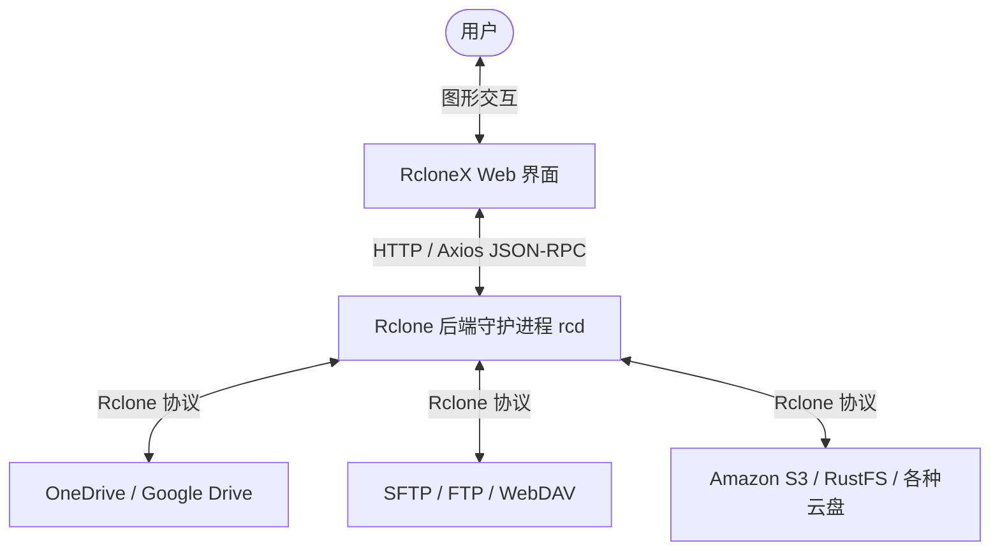

<p align="center">
  <a href="https://github.com/hurole/RcloneX">
    
  </a>
</p>

<h1 align="center">RcloneX</h1>

<p align="center">
  <strong>✨ 基于 React 19 + TypeScript 7.0.2 + Rsbuild v2 + Tailwind CSS v4 构建的现代化、高性能 Rclone Web UI 管理面板 ✨</strong>
</p>

<p align="center">
  <a href="README.md">English</a> •
  <strong>简体中文</strong>
</p>

<p align="center">
  <a href="https://react.dev">
    
  </a>
  <a href="https://www.typescriptlang.org">
    
  </a>
  <a href="https://rsbuild.dev">
    
  </a>
  <a href="https://tailwindcss.com">
    
  </a>
  <a href="https://ui.shadcn.com">
    
  </a>
</p>

<p align="center">
  <a href="#-核心特性">核心特性</a> •
  <a href="#-技术栈亮点">技术栈亮点</a> •
  <a href="#-快速上手">快速上手</a> •
  <a href="#-项目结构">项目结构</a> •
  <a href="#-开发与维护">开发与维护</a> •
  <a href="#-参与贡献">参与贡献</a>
</p>

---

> 🚧 **提示：** 本项目目前处于**积极开发阶段 (Under Active Development)**，功能与 UI 正在快速迭代演进中。欢迎体验并反馈建议！

## 📖 项目简介

**RcloneX** 是一个功能强大且美观的 Rclone 远程控制（Remote Control, RC）API 现代前端客户端。它允许用户通过直观、顺滑的 Web 界面直接管理、配置、浏览和操作连接到 Rclone 的各种远程存储服务。

### 📡 架构示意图



---

## ✨ 核心特性

- 🔒 **安全极简登录**：支持配置 Rclone RC 服务的连接地址、用户名和密码，一键认证并快速建立稳定通信。
- 📊 **实时仪表盘**：直观的图表与状态卡片，实时监控当前传输速率、传输进度、已运行任务、系统资源占用等状态。
- ☁️ **智能云盘看板 (Smart Remote Hub)**：可视化创建、修改、删除及查看 Rclone 存储源配置。支持直达文件管理、一键虚拟磁盘挂载与测试探针。
- 📂 **多功能文件浏览器**：
  - 浏览各个 Remote 盘符的动态目录树。
  - 文件/文件夹的秒级上传、下载、新建、删除。
  - 支持跨远程存储服务之间直接进行文件复制与移动。
- ⏳ **任务与传输队列**：实时监控后台正在进行的同步、复制、移动等长耗时传输任务，进度掌控一目了然。
- ⏱️ **定时任务管理**：周期性后台自动同步与备份规则配置。
- 🔗 **挂载点管理器**：可视化管理和控制 Rclone 的本地挂载点（Mounts），轻松实现云盘本地化。
- 📝 **实时系统日志**：无缝对接并实时流式查看 Rclone 运行日志，便于开发调试与故障排查。
- 🌍 **完整国际化 (i18n)**：完美支持中英文（`zh-CN` / `en-US`）双语切换。

---

## ⚡ 技术栈亮点

RcloneX 深度拥抱现代前端最速生态圈，具备极佳的加载性能与极致的代码规范：

- 🚀 **构建极速化 (Rsbuild v2)**：基于 Rspack 驱动的 Rsbuild 构建工具，冷启动与 HMR（热更新）耗时仅在微秒级别，开发体验极佳。
- 💎 **全新规范 (TypeScript 7 + React 19)**：完全启用 TS Strict 编译标准，代码清爽优雅。
- 🏎️ **代码规范革新 (Oxc Toolchain)**：使用高性能 Oxc 工具链：
  - **`oxlint`**：进行超高速的代码静态语法分析。
  - **`oxfmt`**：配合 `@fka/oxfmt-config` 共享配置进行极速代码格式化排版。
- 🎨 **极致美学 (Tailwind v4 + shadcn/ui)**：全站 UI 基于最新的 shadcn/ui v2 规范，完美自适应折叠布局与亮色/暗色主题。

---

## 🚀 快速上手

### 1. 准备工作

首先确保你的系统安装了 **Node.js (v24.x)** 和 modern 一站式工具链 **nub**。

### 2. 克隆项目与安装

```bash
# 克隆仓库
git clone https://github.com/hurole/RcloneX.git
cd RcloneX

# 安装项目依赖
nub install
```

### 3. 启动本地 Rclone 模拟后端 (需提前安装 Rclone)

```bash
# 启动本地 Rclone 并开启 RC 协议支持
nub run start:rclone
```

> 💡 **提示：**
> 该命令会在本地执行：`rclone rcd --rc-addr :5572 --rc-user dev --rc-pass 1234 --rc-allow-origin http://localhost:3000`

### 4. 开启开发面板

在另一个终端中，运行以下命令启动 RcloneX 前端：

```bash
nub run dev
```

浏览器会自动打开并跳转至 `http://localhost:3000`。在登录页面输入以下测试凭证即可进入系统：

- **RC Address**: `http://localhost:5572`
- **Username**: `dev`
- **Password**: `1234`

---

## 📂 项目结构

```
src/
├── assets/              # 静态资源（包含 appIcon.png）
├── components/          # 共享 UI 组件
│   ├── ui/              # 最新版 shadcn/ui 基础组件
│   ├── Header.tsx       # 全局头部组件
│   └── ErrorFallback.tsx # 错误边界 Fallback 视图
├── hooks/               # 自定义 React Hooks
├── lib/utils/           # 样式合并与基础工具函数
├── locales/             # 国际化翻译文件包 (en-US / zh-CN)
├── pages/               # 各业务路由视图组件
│   ├── App.tsx          # 路由配置入口
│   ├── home/            # 框架主布局 (Sidebar + Header + Outlet)
│   ├── login/           # 登录鉴权页面
│   ├── dashboard/       # 仪表盘状态监控
│   ├── config/          # 云存储配置中心
│   ├── explorer/        # 文件浏览器
│   ├── tasks/           # 后台任务列表
│   ├── mounts/          # 挂载管理器
│   ├── schedules/       # 定时同步任务管理
│   └── logs/            # 系统实时日志
├── shared/utils/        # 共享工具单例（网络请求单例、本地存储读写等）
├── styles/globals.css   # 全局样式与 Tailwind v4 主题
└── index.tsx            # 应用挂载入口
```

---

## 💻 开发与维护

### 常用命令指南

在对代码进行本地开发或打包提交前，可通过 `nub` 运行以下脚本：

| 运行指令              | 命令动作描述                                | 备注                                  |
| :-------------------- | :------------------------------------------ | :------------------------------------ |
| **`nub run dev`**     | 启动开发服务器（支持 HMR）                  | 默认开启端口 3000 并拉起浏览器        |
| **`nub run lint`**    | 运行 **`oxlint`** 进行代码静态语法扫描      | 扫描速度极快，确保无低级代码错误      |
| **`nub run fmt`**     | 运行 **`oxfmt`** 进行全站代码格式化排版     | 采用 `@fka/oxfmt-config` 最佳实践配置 |
| **`nub run check`**   | 运行 **`tsc`** 进行 TypeScript 类型安全校验 | 检验全站没有任何编译级别类型报错      |
| **`nub run test`**    | 运行 **`Vitest`** 进行单元与集成测试        | 执行全站断言，验证无任何回归 Bug      |
| **`nub run build`**   | 执行生产环境编译打包                        | 打包出经过高度优化的静态文件          |
| **`nub run preview`** | 本地预览生产构建打包产物                    | 检验生产打包产物在本地是否运行正常    |

---

## 📄 开源许可证

本项目基于 **MIT License** 开源，详情请参阅 `LICENSE` 文件。
